# **Credit Risk Analysis**

## **Purpose**
The purpose of this project was to create and evaluate different supervised Machine Learning models to see which one could accurately predict credit risk using the SKLearn library.

## **Results**
### **Naive Random Oversampling:**
- **Balanced Accuracy Score**

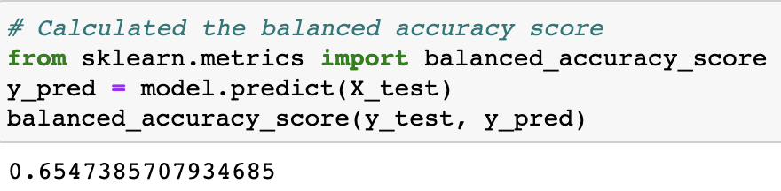

- **Precision and Recall**

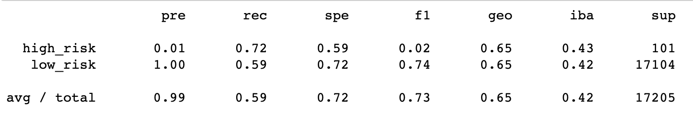

### **SMOTE Oversampling:**
- **Balanced Accuracy Score**

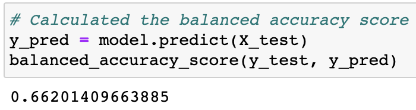

- **Precision and Recall**

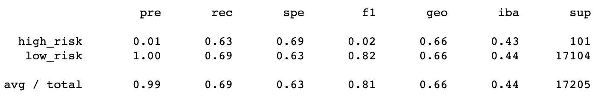

### **ClusterCentroids Undersampling:**
- **Balanced Accuracy Score**

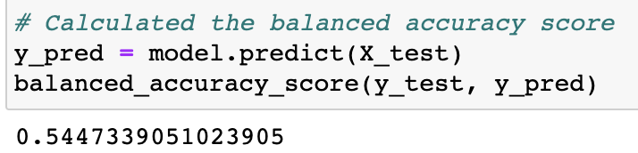

- **Precision and Recall**

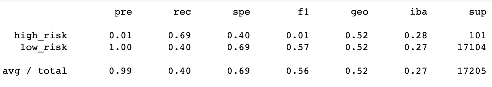

### **SMOTEENN Combination Sampling:**
- **Balanced Accuracy Score**

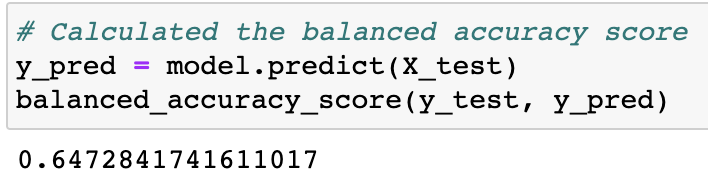

- **Precision and Recall**

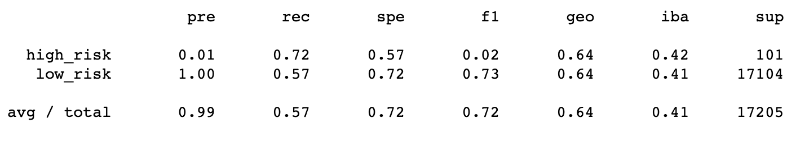

### **Balanced Random Forest Classifier:**
- **Balanced Accuracy Score**

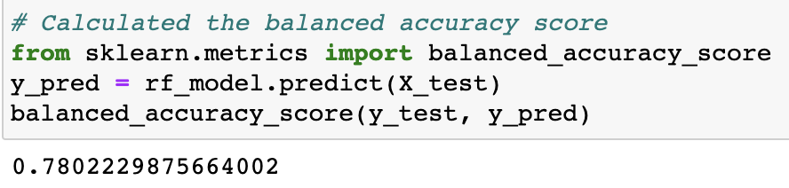

- **Precision and Recall**

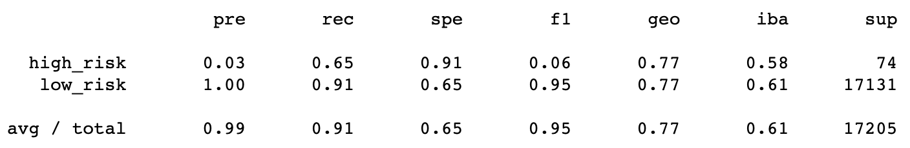

### **Easy Ensemble AdaBoost Classifier:**
- **Balanced Accuracy Score**

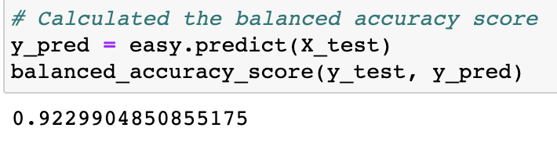

- **Precision and Recall**

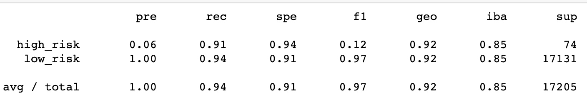

## Summary
- The machine learning model with the best balanced, precision and recall scores was the Easy Ensemble AdaBoost Classifier. It held a .92 Balanced Accuracy Score, and a high-risk precision and recall score of .06 and .91 respectively while holding a low-risk precision and recall score of 1.00 and .94 respectively. I would recommend using the Easy Ensemble AdaBoost Classifier model to predict credit risk because it has the highest accuracy meaning it has the greatest chance of success in predicting things correctly.
- The machine learning model with the worst scores was the ClusterCentroids Undersampling model. It had by far the lowest balanced accuracy score at .54. It also held low high- and low-risk precision and recall scores. High-risk scores were: .01 and .69. Low-risk scores were: 1.00 and .40. Therefore, I would not recommend using the ClusterCentroids Undersampling model.